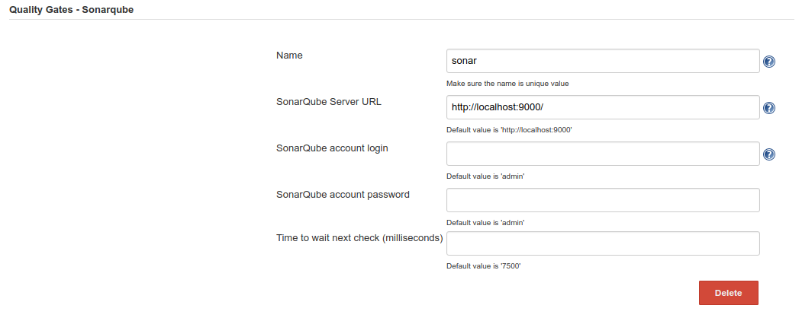

# Sonar Quality Gates Plugin
Jenkins plugin that fails the build if the predefined sonar quality gates are not green.

#### Sonarqube suportted versions

* Sonar 5.6
* Sonar 6.x+

#### Usage 

1. In `Manage Jenkins -> Configure System -> Quality Gates - Sonarqube` add yours sonar configuration.

2. In jenkins job add a `Post-build Actions -> Quality Gates Sonarqube Plugin` and set the sonar instance, if you have multiple sonar configurations, and `Project key` .

_______
###### _Forked from https://github.com/jenkinsci/quality-gates-plugin_
