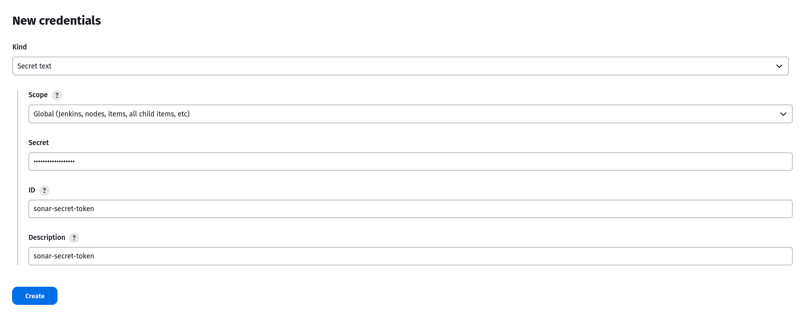
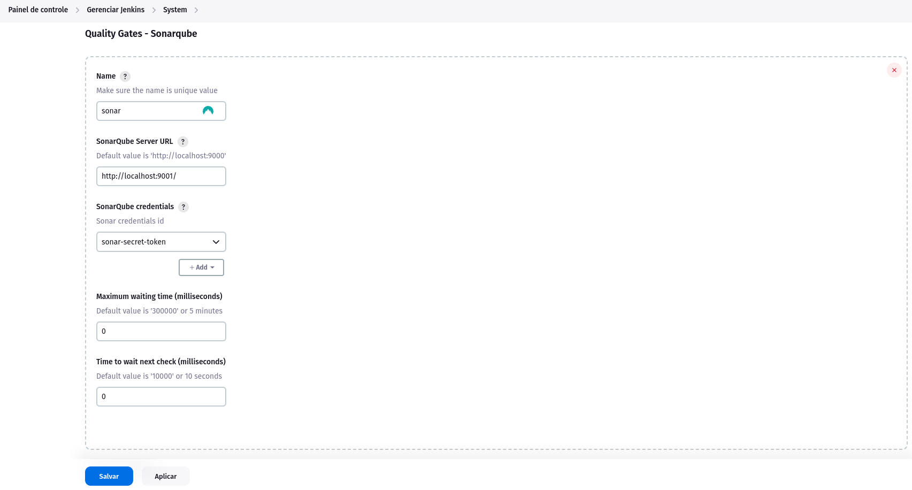
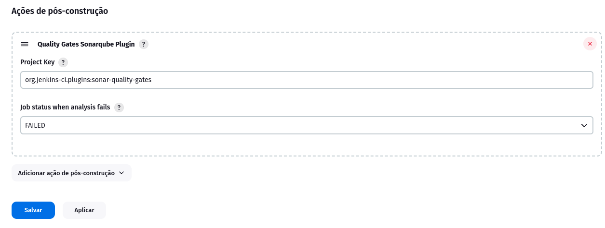

# Sonar Quality Gates Plugin
Jenkins plugin that fails the build if the predefined sonar quality gates are not green.

#### Sonarqube supported versions

* Sonar 8.0+

#### Usage 

1. Create a new secrete with type `Secret text`

   

2. In `Manage Jenkins -> Configure System -> Quality Gates - Sonarqube` add yours sonar configuration.

    

3. In jenkins job add a `Post-build Actions -> Quality Gates Sonarqube Plugin` and set the sonar instance, if you have multiple sonar configurations, and `Project key` .

    

#### Issues

- [Create Issues](https://issues.jenkins-ci.org/issues/?jql=project%20%3D%20JENKINS%20AND%20status%20in%20(Open%2C%20%22In%20Progress%22%2C%20Reopened%2C%20%22In%20Review%22)%20AND%20component%20%3D%20sonar-quality-gates-plugin)
_______
